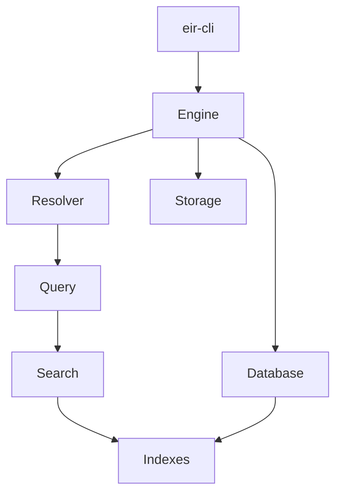
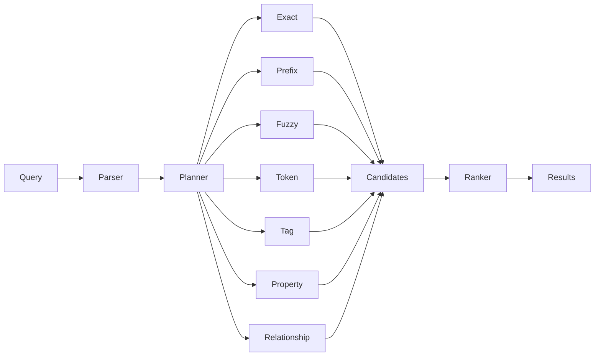

# Entity Identifier Resolver

**Entity Identifier Resolver (EIR)** is a local entity database and search engine written in Rust.

EIR stores structured entities and resolves queries against them using aliases, tokens, tags, attributes, sources, and relationships.

## Status

EIR is under active development.

The core database, storage, indexing, and search systems are implemented and tested. The CLI provides tools for working with EIR databases.

> ⚠️ **EIR is not encrypted. Do not use it to store sensitive data without appropriate external protection.**

---

## Architecture



At the center is `Engine`, which coordinates the database, resolver, and storage backend.

The main flow is:

```text
Entity Documents
       │
       ▼
    Database
       │
       ├── Registries
       └── Indexes
              │
              ▼
           Resolver
              │
              ▼
          Search Results
```

---

## Project Structure

```text
EntityIdentifierResolver/
├── crates/
│   ├── eir-core/
│   ├── eir-cli/
│   └── eir-version/
├── apps/
├── docs/
└── fixtures/
```

### `eir-core`

The core EIR library containing:

* database and engine
* entity model
* storage
* indexes
* query parsing
* search and ranking

### `eir-cli`

Command-line interface for creating, searching, inspecting, and maintaining databases.

### `eir-version`

Database/version-related functionality.

---

## Entity Model

An entity can contain aliases, tags, attributes, relationships, and sources.

```json
{
  "id": 1001,
  "aliases": [
    "FizzBerry Spark",
    "FizzBerry"
  ],
  "tags": [
    "drink",
    "berry"
  ],
  "attributes": [],
  "relationships": [],
  "sources": [
    {
      "provider": "Open Food Facts",
      "verified": true
    }
  ]
}
```

---

## Search

EIR combines multiple search signals.



Search results include the signals that contributed to a match, making results easier to understand and debug.

---

## Storage

An EIR database uses a logical `.eir` database identity together with its supporting storage:

```text
database/
├── database.eir
├── eir.toml
├── segments/
└── wal/
```

The storage layer uses persistent segments and a write-ahead log.


Compaction rewrites persistent storage to remove obsolete data.

---

## CLI

The CLI provides the main database management interface:

```text
init
build
stats
inspect
search
insert
remove
update
compact
merge
server
completions
```

Example:

```bash
cargo eir init data nutrition

cargo eir build \
  --input fixtures/entities.json \
  --database data/nutrition

cargo eir search \
  data/nutrition/nutrition.eir \
  "FizzBerry"
```

See **[CLI Documentation](docs/cli.md)** for the complete command reference.

---

## Development

Clone the repository:

```bash
git clone https://github.com/HandsOnDigits/EntityIdentifierResolver.git
cd EntityIdentifierResolver
```

Check the workspace:

```bash
cargo check --workspace
```

Run the tests:

```bash
cargo test --workspace
```

Format the code:

```bash
cargo fmt --all
```

---

## Documentation

* **[CLI](docs/cli.md)** — command reference and database operations
* **[Repository](https://github.com/HandsOnDigits/EntityIdentifierResolver)** — source code and development

---

## Design Goals

EIR is designed around a few simple principles:

* **Local** — no remote service required
* **Structured** — entities contain more than just names
* **Fast** — specialized indexes for different search operations
* **Explainable** — search results expose matching signals
* **Embeddable** — the core engine is independent of the CLI
* **Recoverable** — persistent storage uses snapshots and WAL

---

## License

See the repository for the current license.

