# Entity Identifier Resolver (EIR)

**Entity Identifier Resolver** is a local entity database and search engine designed for fast, explainable entity resolution.

EIR stores structured entities with aliases, tags, attributes, sources, and relationships, then builds specialized indexes that allow applications to resolve natural-language queries against those entities.

It is written in Rust and is currently designed primarily as a local embedded database/search engine with a command-line interface.

> **Status:** EIR is under active development. The core database, storage, indexing, and search systems are functional and tested. The server command is currently a placeholder.

> ⚠️ **EIR is not encrypted. Do not use it to store sensitive data without appropriate external protection.**

---

## What is EIR?

Traditional lookup systems often assume that the identifier being searched for is already known.

EIR is designed for the opposite situation:

```text
         Input
           │
           │ "fizzberry"
           ▼
┌──────────────────────┐
│ Entity Identifier    │
│ Resolver             │
└──────────┬───────────┘
           │
           ▼
     Candidate entities
           │
           ▼
    Ranked search results
```

An entity can have multiple identifiers and pieces of metadata:

```json
{
  "id": 1001,
  "aliases": [
    "FizzBerry Spark",
    "Berry Spark",
    "FizzBerry"
  ],
  "tags": [
    "drink",
    "berry"
  ],
  "attributes": [],
  "relationships": [],
  "sources": [
    {
      "provider": "Open Food Facts",
      "verified": true
    }
  ]
}
```

EIR can then resolve queries using several independent signals rather than relying on a single string comparison.

---

# Features

EIR currently provides:

* Exact alias matching
* Prefix alias matching
* Fuzzy alias matching
* Token search
* Tag search
* Attribute search
* Source indexing
* Relationship indexing
* Query parsing
* Query intent
* Search planning
* Candidate generation
* Search ranking
* Explainable search signals
* Persistent databases
* Write-ahead logging
* Database recovery
* Database updates
* Database removal
* Database compaction
* Database merging
* CLI tooling

---

# Architecture

The project is split into several layers.

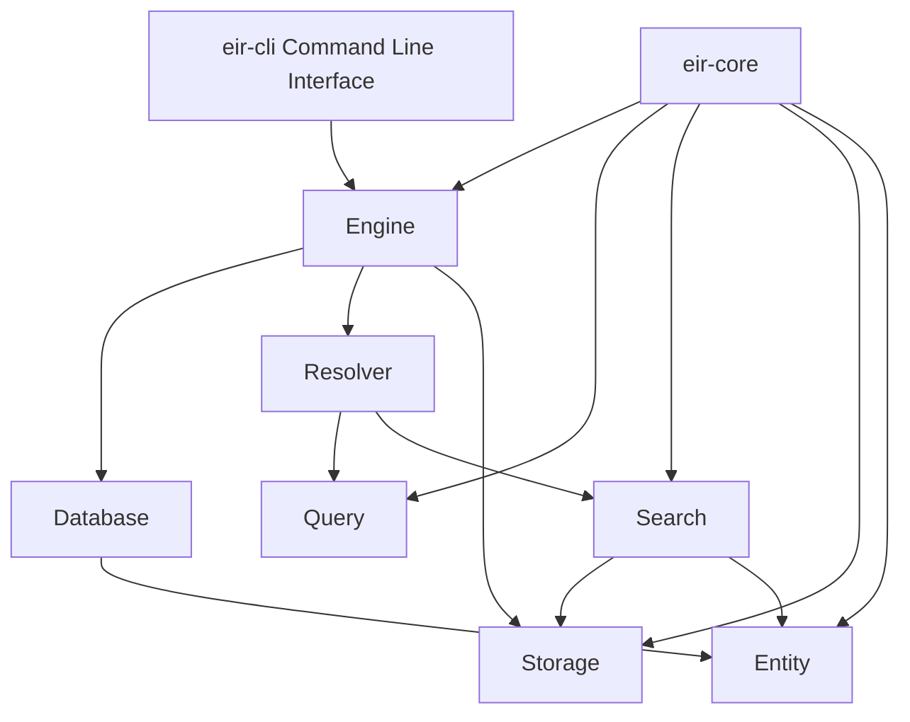

The important architectural boundary is between the **logical database**, **persistent storage**, and **search engine**.

The CLI is intentionally thin and delegates database operations to `Engine`.

---

# Project Structure

The current Cargo workspace contains three crates:

```text
EntityIdentifierResolver/
│
├── Cargo.toml
│
├── crates/
│   │
│   ├── eir-core/
│   │   └── src/
│   │       ├── config/
│   │       ├── engine/
│   │       ├── entity/
│   │       ├── error/
│   │       ├── query/
│   │       ├── search/
│   │       ├── storage/
│   │       ├── utils/
│   │       └── index/
│   │
│   ├── eir-cli/
│   │   └── src/
│   │       ├── commands/
│   │       ├── builder.rs
│   │       ├── cli.rs
│   │       └── main.rs
│   │
│   └── eir-version/
│
├── apps/
│
├── docs/
│
└── fixtures/
```

The workspace currently declares `eir-core`, `eir-cli`, and `eir-version` as its members.

---

# The Whole System

The following diagram shows the intended relationship between the major parts of EIR.

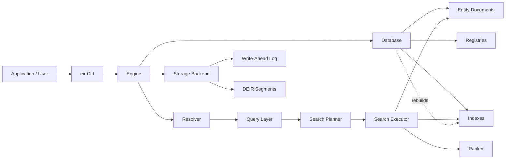

At runtime, `Engine` is the central lifecycle object. It owns:

```text
Engine
├── Backend
├── Database
└── Resolver
```

This is the current structure in `eir-core`.

---

# Engine

`Engine` is the high-level API for working with an EIR database.

It provides operations for:

```text
create
open
stats
search
entity
insert
remove
update
flush
compact
```

The engine owns the three major runtime components:

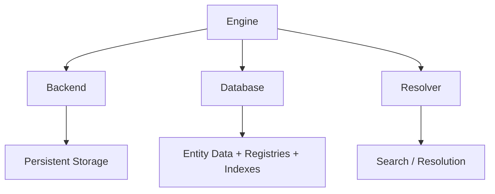

The implementation currently constructs `Engine` with a `Backend`, `Database`, and `Resolver`.

---

# Database

The logical `Database` contains the entity collection and the structures required to search it.

Conceptually:

```text
Database
├── Entities
├── Tag Registry
├── Source Registry
├── Attribute-Key Registry
├── Relationship-Type Registry
└── Indexes
```

The registries allow repeated strings to be represented using compact internal IDs.

For example:

```text
"drink"
"berry"
"Open Food Facts"
"MadeBy"
```

can be interned into registry identifiers and then used by posting lists and other indexes.

---

# Entity Model

An EIR entity is represented by an `EntityDocument`.

An entity can contain:

```text
EntityDocument
├── EntityID
├── Aliases
├── Tags
├── Attributes
├── Relationships
└── Sources
```

A simplified example:

```json
{
  "id": 1001,
  "aliases": [
    "FizzBerry Spark",
    "Berry Spark"
  ],
  "tags": [
    "drink",
    "berry"
  ],
  "attributes": [],
  "relationships": [],
  "sources": [
    {
      "provider": "Open Food Facts",
      "verified": true
    }
  ]
}
```

This flexible model is important because entity resolution often depends on more than names.

---

# Query Architecture

Search input first passes through the query layer.

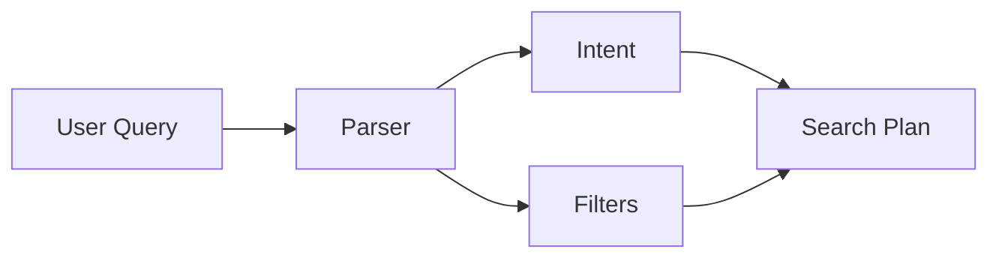

The query module currently contains:

```text
query/
├── filters.rs
├── intent.rs
├── parser.rs
└── types.rs
```

The query layer is responsible for representing what the user is asking for before search execution begins.

---

# Search Pipeline

Once a query has been parsed, EIR plans and executes search stages.

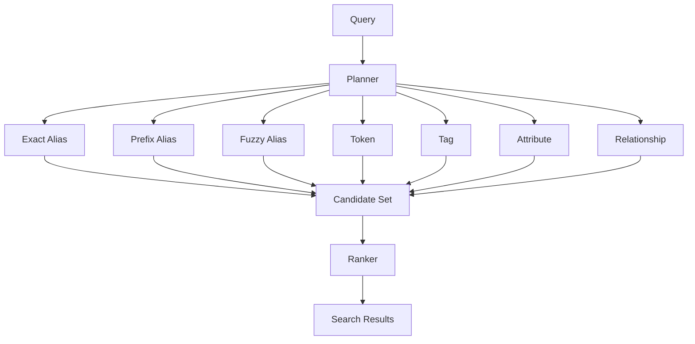

The search module currently contains components for:

```text
search/
├── candidate
├── context
├── executor
├── operators
├── planner
├── ranker
├── result
├── signal
└── tests
```

The public search types include `CandidateSet`, `SearchExecutor`, `SearchPlan`, `SearchStage`, `Ranker`, `Signal`, and `SignalSet`.

---

# Search Signals

A search result can contain multiple signals.

Examples include:

```text
ExactAlias
PrefixAlias
FuzzyAlias
Token
Tag
Property
Relationship
```

A candidate may therefore match through several independent mechanisms.

For example:

```text
Query: "fizzberry"

FizzBerry Spark
├── ExactAlias
├── PrefixAlias
└── Token
```

The ranking layer can use these signals when producing the final result ordering.

This is preferable to treating search as a single fuzzy string comparison.

---

# Indexing

EIR maintains specialized indexes for different types of search.

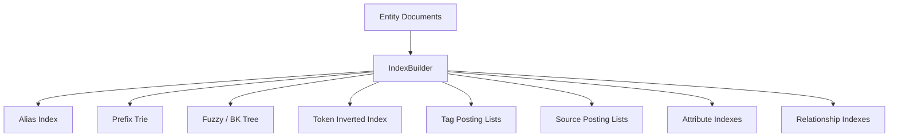

The storage layer exposes `IndexBuilder`, `Indexes`, `PostingList`, and registry types.

Indexes can be rebuilt from the database's current entity state.

This gives EIR a straightforward consistency model:

```text
Entity Documents
       │
       ▼
 Index Builder
       │
       ▼
Search Indexes
```

After mutations, the resolver is reconstructed from the current database state.

---

# Persistence

EIR separates logical database identity from physical storage.

Creating:

```text
data/nutrition/nutrition.eir
```

produces a database layout conceptually like:

```text
data/
└── nutrition/
    ├── nutrition.eir
    ├── eir.toml
    ├── segments/
    │   ├── ...
    │   └── ...
    └── wal/
```

The `.eir` file is the public database identity.

Physical data is stored alongside it.

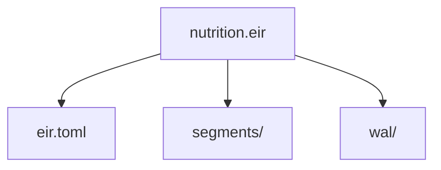

The current `Engine::create()` implementation explicitly creates the `.eir` identity file while the backend manages physical storage.

---

# Write-Ahead Logging

Mutations are written to the WAL before being applied to the in-memory database.

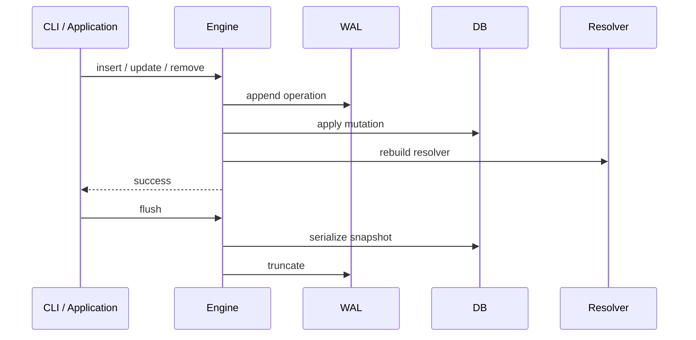

On startup, the engine:

```text
Open .eir
   │
   ▼
Load configuration
   │
   ▼
Open backend
   │
   ▼
Load persisted snapshot
   │
   ▼
Replay WAL
   │
   ▼
Build resolver
   │
   ▼
Ready
```

The current implementation replays `Insert`, `Remove`, and `Update` WAL operations when opening a database.

---

# Compaction

Mutations can leave obsolete data in persistent segments.

Compaction rewrites the storage representation using the current database state.

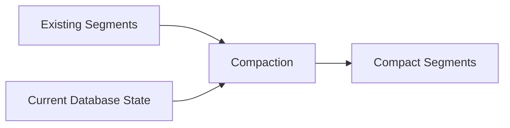

The important distinction is:

```text
remove entity
    ≠
immediately shrink segment files
```

Instead:

```text
remove
  │
  ▼
new logical database state
  │
  ▼
compact
  │
  ▼
reclaimed physical storage
```

This is why `compact` exists as a separate database maintenance operation.

---

# Database Merge

EIR can combine two databases into a new output database.

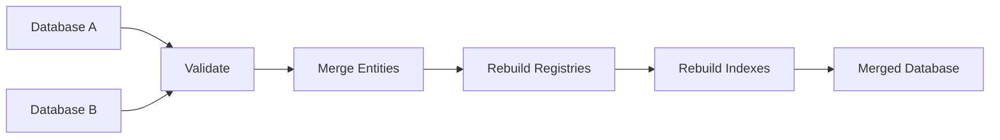

The merge operation is intended to preserve the logical entity model while rebuilding the structures needed by the resulting database.

Duplicate entity IDs are not silently overwritten.

---

# CLI

The `eir` command provides the development and administration interface.

Current commands include:

```text
init
build
stats
inspect
search
insert
remove
update
compact
merge
server
completions
```

The current CLI dispatches these operations through the command implementations in `eir-cli`.

---

# CLI Quick Start

## Create a database

```bash
cargo eir init data nutrition
```

## Build a database

```bash
cargo eir build \
  --input entities.json \
  --database data/nutrition
```

## Inspect an entity

```bash
cargo eir inspect \
  data/nutrition/nutrition.eir \
  1001
```

## Search

```bash
cargo eir search \
  data/nutrition/nutrition.eir \
  "fizzberry"
```

## Show statistics

```bash
cargo eir stats \
  data/nutrition/nutrition.eir
```

## Insert

```bash
cargo eir insert \
  data/nutrition/nutrition.eir \
  new-entities.json
```

## Update

```bash
cargo eir update \
  data/nutrition/nutrition.eir \
  1001 \
  --input updated-entity.json
```

## Remove

```bash
cargo eir remove \
  data/nutrition/nutrition.eir \
  1001
```

## Compact

```bash
cargo eir compact \
  data/nutrition/nutrition.eir
```

## Merge

```bash
cargo eir merge \
  left/left.eir \
  right/right.eir \
  merged/merged.eir
```

For complete command syntax, see [`docs/cli.md`](docs/cli.md).

---

# Development

Clone the repository:

```bash
git clone https://github.com/HandsOnDigits/EntityIdentifierResolver.git
cd EntityIdentifierResolver
```

Check the workspace:

```bash
cargo check --workspace
```

Run all tests:

```bash
cargo test --workspace
```

Run core tests:

```bash
cargo test -p eir-core
```

Run CLI tests:

```bash
cargo test -p eir-cli
```

---

# Testing the Architecture

EIR's test suite covers the important database lifecycle operations.

For example, the engine tests cover:

```text
Create
  │
  ▼
Insert
  │
  ▼
Flush
  │
  ▼
Open
  │
  ▼
Recover
  │
  ▼
Search
```

They also cover:

* WAL recovery after unflushed inserts
* WAL recovery after removals
* WAL recovery after updates
* invalid mutation handling
* duplicate entity detection
* compaction
* persistence round trips
* index rebuilding

These tests are important because the database is now more than a serialized collection of entities: it has a storage lifecycle involving snapshots, WAL operations, segments, and resolver reconstruction.

---

# Workspace Components

## `eir-core`

The core EIR library.

It currently exposes:

```text
config
engine
entity
error
query
search
storage
utils
```

and contains the internal indexing/resolution implementation.

Use this crate when embedding EIR into another Rust application.

---

## `eir-cli`

The command-line interface.

It provides:

```text
Database lifecycle
Search
Inspection
Statistics
Mutation
Compaction
Merge
Shell completions
```

The CLI delegates database operations to `eir-core`.

---

## `eir-version`

Version-related functionality used by the project as the database format and merge architecture evolves.

---

# Design Principles

EIR is built around several principles.

### Local first

The database is designed to run locally without requiring a remote service.

### Deterministic data

The database is built from explicit entity documents rather than an opaque external service.

### Multiple search signals

Resolution should not depend entirely on fuzzy string matching.

### Explainability

Search results expose the signals that contributed to a match.

### Structured entities

Names are only one part of an entity.

Tags, attributes, sources, and relationships can all participate in resolution.

### Separate logical and physical storage

The logical database model is separated from segments, WAL, and other storage implementation details.

### Library first

The CLI is an interface to the core engine rather than the implementation of the engine itself.

---

# Future Architecture

The current architecture leaves room for several interfaces over the same engine:

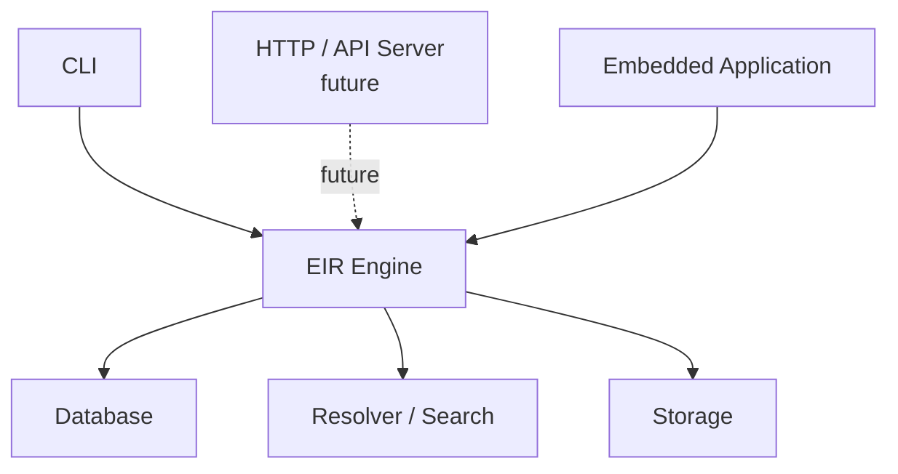

This allows the database and search implementation to remain independent of how clients interact with EIR.

---

# Roadmap

The project is actively evolving.

Areas of development include:

* More efficient incremental indexing
* Improved search ranking
* Additional query operators
* More sophisticated relationship queries
* Better database format/version handling
* Server/API implementation
* Performance benchmarking
* Larger real-world datasets
* Improved CLI ergonomics
* A way to support CSV imports

---

# Security

EIR does not currently provide encryption.

Do not store passwords, authentication credentials, private keys, personal secrets, or other sensitive information in an EIR database unless the storage environment provides appropriate encryption and access controls.

EIR is optimized for entity search and resolution, not secure secret storage.

---

# License

See the repository's license files for the current licensing terms.

---

# Contributing

Contributions, bug reports, tests, documentation improvements, and architectural discussion are welcome.

Before submitting changes, run:

```bash
cargo fmt --all
cargo check --workspace
cargo test --workspace
```

For larger architectural changes, please document the intended impact on:

* `eir-core`
* storage
* indexing
* query planning
* search
* CLI behavior
* database compatibility

---

# Summary

EIR can be thought of as four major systems working together:


The complete runtime architecture is:

```text
                         EIR
                          │
          ┌───────────────┼────────────────┐
          │               │                │
       eir-cli          eir-core       eir-version
                          │
             ┌────────────┼─────────────┐
             │            │             │
          Engine        Query        Storage
             │            │             │
       ┌─────┴─────┐      │       ┌─────┴─────┐
       │           │      │       │           │
    Database    Resolver  │      WAL       Segments
       │           │      │
   Entities     Search    │
   Registries      │      │
   Indexes      Planner   │
                Executor  │
                Ranker    │
```

EIR's core job is simple:

> **Take structured entities, build efficient indexes, understand a query, find plausible candidates, and return explainable ranked matches.**

Everything else—storage, WAL, compaction, the CLI, and future APIs—exists to make that core capability reliable and usable.

Contains AI-Assisted Code
