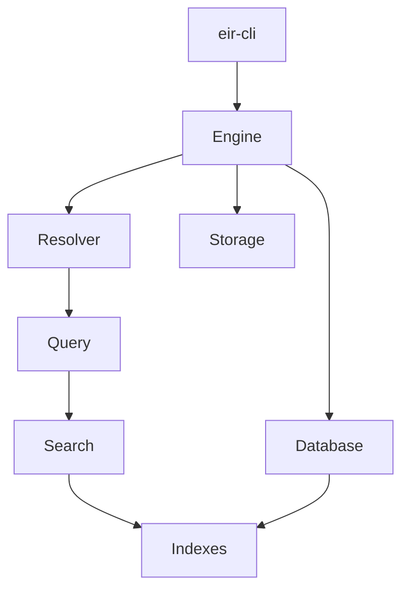
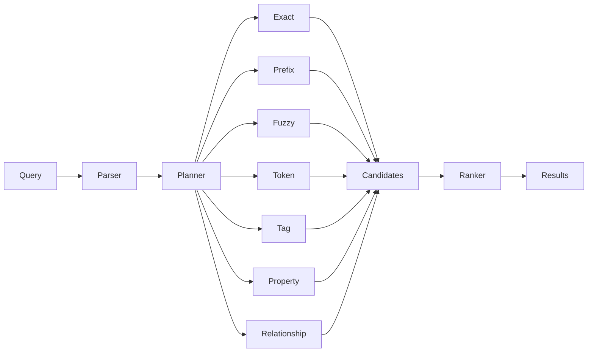
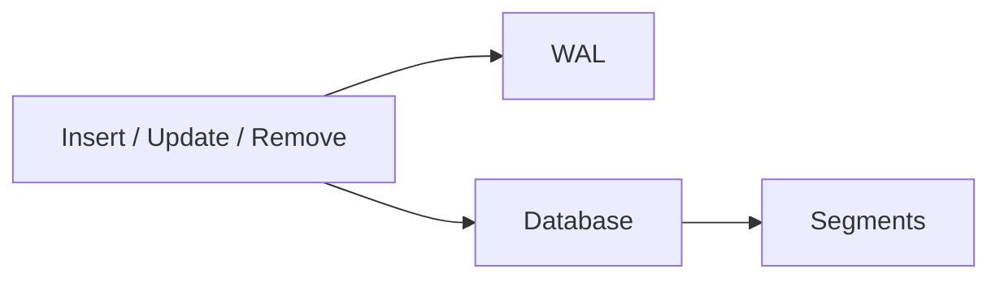

# Entity Identifier Resolver

**Entity Identifier Resolver (EIR)** is a local entity database and search engine written in Rust.

EIR stores structured entities and resolves queries against them using aliases, tokens, tags, attributes, sources, and relationships.

## Status

EIR is under active development.

The core database, storage, indexing, and search systems are implemented and tested. The CLI provides tools for working with EIR databases.

> ⚠️ **EIR is not encrypted. Do not use it to store sensitive data without appropriate external protection.**

---

## Architecture



At the center is `Engine`, which coordinates the database, resolver, and storage backend.

The main flow is:

```text
Entity Documents
       │
       ▼
    Database
       │
       ├── Registries
       └── Indexes
              │
              ▼
           Resolver
              │
              ▼
          Search Results
```

---

## Project Structure

```text
EntityIdentifierResolver/
├── crates/
│   ├── eir-core/
│   ├── eir-cli/
│   └── eir-version/
├── apps/
├── docs/
└── fixtures/
```

### `eir-core`

The core EIR library containing:

* database and engine
* entity model
* storage
* indexes
* query parsing
* search and ranking

### `eir-cli`

Command-line interface for creating, searching, inspecting, and maintaining databases.

### `eir-version`

Database/version-related functionality.

---

## Entity Model

An entity can contain aliases, tags, attributes, relationships, and sources.

```json
{
  "id": 1001,
  "aliases": [
    "FizzBerry Spark",
    "FizzBerry"
  ],
  "tags": [
    "drink",
    "berry"
  ],
  "attributes": [],
  "relationships": [],
  "sources": [
    {
      "provider": "Open Food Facts",
      "verified": true
    }
  ]
}
```

---

## Search

EIR combines multiple search signals.



Search results include the signals that contributed to a match, making results easier to understand and debug.

---

## Storage

An EIR database uses a logical `.eir` database identity together with its supporting storage:

```text
database/
├── database.eir
├── eir.toml
├── segments/
└── wal/
```

The storage layer uses persistent segments and a write-ahead log.



Compaction rewrites persistent storage to remove obsolete data.

---

## CLI

The CLI provides the main database management interface:

```text
init
build
stats
inspect
search
insert
remove
update
compact
merge
server
completions
```

Example:

```bash
cargo eir init data nutrition

cargo eir build \
  --input fixtures/entities.json \
  --database data/nutrition

cargo eir search \
  data/nutrition/nutrition.eir \
  "FizzBerry"
```

See **[CLI Documentation](docs/cli.md)** for the complete command reference.

---

## Development

Clone the repository:

```bash
git clone https://github.com/HandsOnDigits/EntityIdentifierResolver.git
cd EntityIdentifierResolver
```

Check the workspace:

```bash
cargo check --workspace
```

Run the tests:

```bash
cargo test --workspace
```

Format the code:

```bash
cargo fmt --all
```

---

## Documentation

* **[CLI](docs/cli.md)** — command reference and database operations
* **[Repository](https://github.com/HandsOnDigits/EntityIdentifierResolver)** — source code and development

---

## Design Goals

EIR is designed around a few simple principles:

* **Local** — no remote service required
* **Structured** — entities contain more than just names
* **Fast** — specialized indexes for different search operations
* **Explainable** — search results expose matching signals
* **Embeddable** — the core engine is independent of the CLI
* **Recoverable** — persistent storage uses snapshots and WAL

---

# Entity Identifier Resolver — TODO

## 🏗️ Core Architecture

### Completed
- [x] Rust workspace
- [x] `eir-core` crate
- [x] `eir-cli` crate
- [x] `eir-version` crate
- [x] Entity model
- [x] `EntityID`
- [x] `EntityType`
- [x] Entity aliases
- [x] Tags
- [x] Sources
- [x] Attributes
- [x] Relationships
- [x] Registries / interners
- [x] Database abstraction
- [x] Engine abstraction
- [x] Resolver abstraction

### Planned
- [ ] Stabilize public core API
- [ ] Document core architecture
- [ ] Define database compatibility/versioning policy
- [ ] Improve error model

---

## 🔎 Search & Entity Resolution

### Completed
- [x] Exact alias search
- [x] Prefix alias search
- [x] Fuzzy alias search
- [x] Token search
- [x] Tag search
- [x] Attribute/property search
- [x] Relationship search
- [x] Alias index
- [x] Prefix trie
- [x] Fuzzy/BK-tree index
- [x] Token inverted index
- [x] Posting lists
- [x] Query parser
- [x] Query intent
- [x] Query filters
- [x] Search planner
- [x] Search executor
- [x] Search stages
- [x] Candidate collection
- [x] Search signals
- [x] Ranking
- [x] Search explanations
- [x] Search tests

### Planned
- [ ] Improve ranking quality
- [ ] Tune fuzzy matching
- [ ] Add more query operators
- [ ] Improve relationship queries
- [ ] Improve search explanations
- [ ] Benchmark search performance
- [ ] Test against larger real-world datasets
- [ ] Add configurable ranking strategies

---

## 💾 Database & Storage

### Completed
- [x] Database lifecycle
- [x] Database creation
- [x] Database opening
- [x] `.eir` database identity
- [x] `eir.toml` configuration
- [x] Storage configuration
- [x] DEIR storage format
- [x] Storage segments
- [x] Segment manager
- [x] Backend abstraction
- [x] Write-ahead log (WAL)
- [x] WAL replay
- [x] Database recovery
- [x] Snapshot persistence
- [x] Flush
- [x] Index rebuilding
- [x] Database statistics

---

## ✏️ Entity Mutations

### Completed
- [x] Insert entities
- [x] Remove entities
- [x] Update entities
- [x] Duplicate entity detection
- [x] Entity validation
- [x] Index rebuild after mutation
- [x] WAL support for insert
- [x] WAL support for remove
- [x] WAL support for update
- [x] Mutation recovery tests

---

## 🧹 Compaction

### Completed
- [x] Compact command
- [x] Segment rewrite
- [x] Remove obsolete storage data
- [x] Report storage size before/after
- [x] Report reclaimed space
- [x] Compaction tests

### Planned
- [ ] Add automatic compaction policy
- [ ] Add configurable compaction thresholds

---

## 🔀 Database Merge

### Completed
- [x] Merge command
- [x] Merge two databases
- [x] Duplicate entity ID detection
- [x] Reject output/input collisions
- [x] Combine entity collections
- [x] Rebuild merged indexes
- [x] Merge tests

### Planned
- [ ] Support merging more than two databases
- [ ] Improve merge performance
- [ ] Add merge conflict strategies
- [ ] Document registry remapping
- [ ] Add large-database merge benchmarks

---

## 🖥️ CLI

### Completed
- [x] CLI with Clap
- [x] `init`
- [x] `build`
- [x] `stats`
- [x] `inspect`
- [x] `search`
- [x] `insert`
- [x] `remove`
- [x] `update`
- [x] `compact`
- [x] `merge`
- [x] `server` command structure
- [x] Shell completions
- [x] CLI integration tests
- [x] Database lifecycle tests

### Planned
- [ ] Finish server implementation
- [ ] Improve CLI output formatting
- [ ] Add machine-readable output
- [ ] Improve error messages
- [ ] Improve command help
- [ ] Add CLI benchmarks
- [ ] Add support for CSV file import

---

## 🌐 Server / API

### Completed
- [x] Server command scaffold
- [x] Server lifecycle command structure

### Planned
- [ ] HTTP API
- [ ] Search endpoint
- [ ] Entity lookup endpoint
- [ ] Entity insertion endpoint
- [ ] Entity update endpoint
- [ ] Entity removal endpoint
- [ ] Database statistics endpoint
- [ ] Health endpoint
- [ ] API documentation
- [ ] Authentication strategy
- [ ] Request validation
- [ ] API integration tests

---

## 📦 Data & Fixtures

### Completed
- [x] JSON entity fixtures
- [x] Test entities
- [x] Test sources
- [x] Test tags
- [x] Test attributes
- [x] Test relationships
- [x] Larger test database
- [x] CLI lifecycle fixture tests

### Planned
- [ ] CSV entity fixtures

---

## 🧪 Testing

### Completed
- [x] Unit tests
- [x] Database lifecycle tests
- [x] Persistence tests
- [x] WAL recovery tests
- [x] Insert tests
- [x] Remove tests
- [x] Update tests
- [x] Compaction tests
- [x] Merge tests
- [x] Search tests
- [x] Query tests
- [x] CLI tests
- [x] Duplicate ID tests
- [x] Output/input collision tests

### Planned
- [ ] Large dataset tests
- [ ] Performance benchmarks
- [ ] Search relevance benchmarks
- [ ] Storage benchmarks
- [ ] Fuzz testing
- [ ] Crash/recovery testing
- [ ] Concurrency testing

---

## 📚 Documentation

### Completed
- [x] CLI documentation
- [x] Architecture documentation
- [x] Search architecture documentation
- [x] Storage documentation
- [x] Mermaid architecture diagrams
- [x] README architecture overview

### Planned
- [ ] Keep README aligned with source
- [ ] Keep CLI docs aligned with commands
- [ ] Database format documentation
- [ ] Entity schema documentation
- [ ] Search/query documentation
- [ ] Storage format specification
- [ ] API documentation
- [ ] Contributor guide
- [ ] Architecture decision records

---

## 🚀 Performance

### Planned
- [ ] Benchmark database creation
- [ ] Benchmark inserts
- [ ] Benchmark updates
- [ ] Benchmark deletes
- [ ] Benchmark search
- [ ] Benchmark fuzzy search
- [ ] Benchmark index building
- [ ] Benchmark database opening
- [ ] Benchmark WAL replay
- [ ] Benchmark compaction
- [ ] Benchmark merge
- [ ] Memory usage profiling
- [ ] Large-dataset testing
- [ ] Investigate GPU acceleration

---

## 🔐 Security & Privacy

### Current
- [x] Local-first architecture
- [x] No search history by default
- [x] No external service required for core search
- [x] No telemetry in the core engine

### Planned
- [ ] Document security model
- [ ] Document filesystem permissions
- [ ] Optional database encryption strategy
- [ ] API authentication
- [ ] API authorization
- [ ] Security audit

---

## 🎯 Project Milestones

### Phase 1 — Core Engine
- [x] Entity model
- [x] Database
- [x] Storage
- [x] Indexing
- [x] Resolver
- [x] Search

### Phase 2 — Database Lifecycle
- [x] Persistence
- [x] WAL
- [x] Recovery
- [x] Insert
- [x] Update
- [x] Remove
- [x] Compaction
- [x] Merge

### Phase 3 — CLI
- [x] Database creation
- [x] Build
- [x] Search
- [x] Inspect
- [x] Stats
- [x] Mutations
- [x] Maintenance commands

### Phase 4 — Production Readiness
- [ ] Performance benchmarks
- [ ] Large dataset testing
- [ ] Complete documentation
- [ ] Stable public API
- [ ] Error handling review
- [ ] Recovery testing

### Phase 5 — API & Applications
- [ ] HTTP server
- [ ] API
- [ ] TypeScript client
:::
## License

See the repository for the current license.

Contains AI Assisted Code
