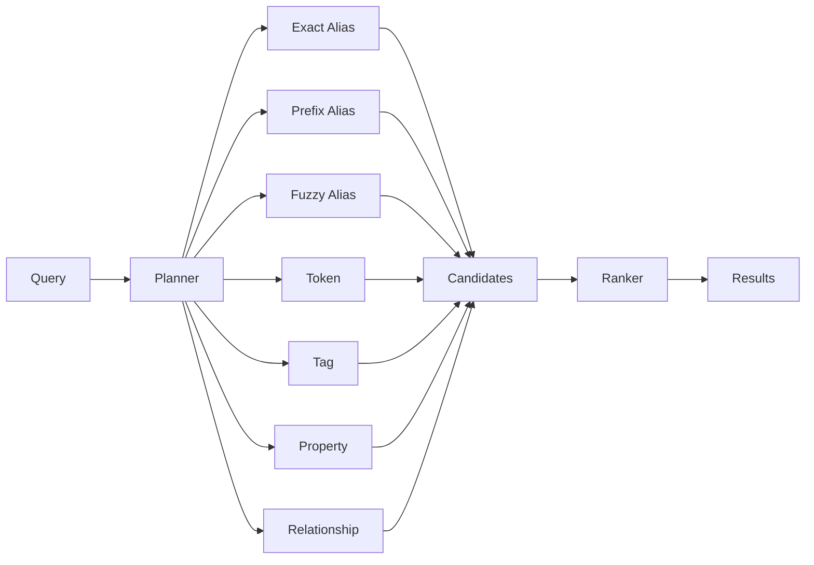
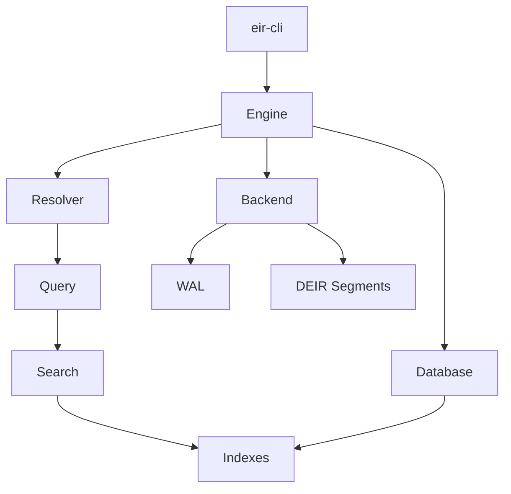
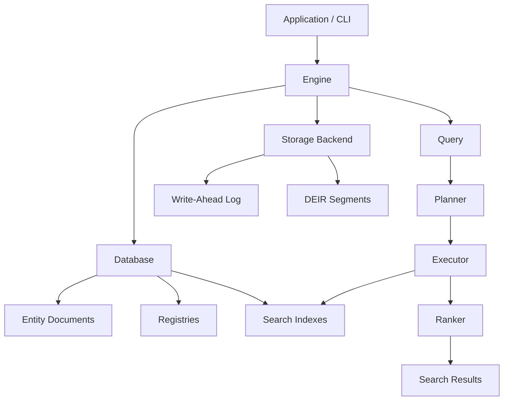

# Entity Identifier Resolver

**Entity Identifier Resolver (EIR)** is a local, strongly typed entity database and search engine written in Rust.

It is designed for applications that need to find an entity from names, metadata, or relationships rather than from a single known identifier.

## Status

EIR is under active development. The CLI, storage, and search systems are functional and tested. The server is currently a CLI placeholder.

> ⚠️ **Warning:** EIR is not encrypted. Do not use it to store sensitive data.

---

## Entity Model

An EIR database contains entities identified by an `EntityID`.

An entity can have several aliases, tags, sources, attributes, and relationships:

```json
{
  "id": 1001,
  "aliases": [
    "FizzBerry Spark",
    "FizzBerry",
    "Berry Spark"
  ],
  "tags": [
    "drink",
    "berry"
  ],
  "sources": [
    {
      "provider": "Open Food Facts",
      "verified": true
    }
  ],
  "attributes": [],
  "relationships": []
}
```

### Aliases

Aliases are names that can be used to find an entity.

For example, the same entity might be known as:

```text
FizzBerry Spark
FizzBerry
Berry Spark
```

EIR can search aliases using exact, prefix, and fuzzy matching.

### Tags

Tags provide categories or other labels associated with an entity.

```text
FizzBerry Spark
├── drink
└── berry
```

Tags can also participate in searches.

### Sources

Sources record where information about an entity came from.

An entity can have information from several providers, and source information can be used during search and inspection.

### Attributes

Attributes describe properties of an entity.

For example:

```text
brand    = FizzBerry
category = Soft Drink
country  = Denmark
```

Unlike an alias, an attribute describes the entity rather than providing another name for it.

### Relationships

Relationships connect one entity to another.

For example:

```text
FizzBerry Spark
      │
      └── manufactured_by ──> FizzBerry Foods
```

This allows EIR to use information about related entities when resolving a query.

---

## Search

EIR does not use one search algorithm for every query.

A query can be handled by several search operations:



The search system records which operations produced each candidate. This makes it possible to see why an entity matched a query.

For example, a result might have matched through:

```text
ExactAlias
Token
Tag
```

rather than simply returning a score with no explanation.

---

## Database

The database contains the entities and the structures needed to search them.

```text
Database
├── Entities
├── Tag Registry
├── Source Registry
├── Attribute-Key Registry
├── Relationship-Type Registry
└── Indexes
```

Registries assign internal identifiers to repeated values such as tags, source names, attribute keys, and relationship types.

Indexes provide the structures used to find entities efficiently.

The indexes are built from the current database contents and include structures for aliases, prefixes, fuzzy matching, tokens, tags, sources, attributes, and relationships.

---

## Storage

The logical database is stored using persistent storage managed by the EIR engine.

A database has a layout similar to:

```text
database/
├── database.eir
├── eir.toml
├── segments/
└── wal/
```

The storage backend uses DEIR segments and a write-ahead log.

The WAL records database mutations so they can be recovered if necessary.

Compaction can later rewrite the stored data to remove obsolete storage.

---

## Architecture

The main runtime object is `Engine`.



`Engine` coordinates the database, resolver, and storage backend.

The database contains the entity data and indexes, while the resolver uses those indexes to perform searches.

---

## Whole System



This is the overall flow:

```text
Entity data
    │
    ▼
Database
    │
    ├── Registries
    └── Search indexes
             │
             ▼
          Resolver
             │
             ▼
           Query
             │
             ▼
          Results
```

---

## CLI

The `eir` CLI provides tools for working with databases.

Current commands include:

```text
init
build
stats
inspect
search
insert
remove
update
compact
merge
server
completions
```

For example:

```bash
cargo eir init data nutrition

cargo eir build \
  --input entities.json \
  --database data/nutrition

cargo eir search \
  data/nutrition/nutrition.eir \
  "FizzBerry"
```

See [`docs/cli.md`](docs/cli.md) for the complete command reference.

---

## Project Structure

```text
EntityIdentifierResolver/
├── crates/
│   ├── eir-core/
│   ├── eir-cli/
│   └── eir-version/
├── apps/
├── docs/
└── fixtures/
```

### `eir-core`

The core database and search engine.

It contains the entity model, engine, storage, indexing, query, and search systems.

### `eir-cli`

The command-line interface built on top of `eir-core`.

### `eir-version`

Version-related functionality used by the database and merge system.

---

## Development

Clone the repository:

```bash
git clone https://github.com/HandsOnDigits/EntityIdentifierResolver.git
cd EntityIdentifierResolver
```

Check the workspace:

```bash
cargo check --workspace
```

Run the tests:

```bash
cargo test --workspace
```

Format the code:

```bash
cargo fmt --all
```

---

## Documentation

* [`docs/cli.md`](docs/cli.md) — CLI commands and database operations
* [`docs/model.md`](docs/model.md) — entity model reference

---

## License

See [`LICENSE`](LICENSE) for the license.

---

## Design Goals

EIR is designed around a few simple principles:

* **Local** — no remote service required
* **Structured** — entities contain more than just names
* **Fast** — specialized indexes for different search operations
* **Explainable** — search results expose matching signals
* **Embeddable** — the core engine is independent of the CLI
* **Recoverable** — persistent storage uses snapshots and WAL

---

# Entity Identifier Resolver — TODO

## 🏗️ Core Architecture

### Completed
- [x] Rust workspace
- [x] `eir-core` crate
- [x] `eir-cli` crate
- [x] `eir-version` crate
- [x] Entity model
- [x] `EntityID`
- [x] `EntityType`
- [x] Entity aliases
- [x] Tags
- [x] Sources
- [x] Attributes
- [x] Relationships
- [x] Registries / interners
- [x] Database abstraction
- [x] Engine abstraction
- [x] Resolver abstraction

### Planned
- [ ] Stabilize public core API
- [ ] Document core architecture
- [ ] Define database compatibility/versioning policy
- [ ] Improve error model

---

## 🔎 Search & Entity Resolution

### Completed
- [x] Exact alias search
- [x] Prefix alias search
- [x] Fuzzy alias search
- [x] Token search
- [x] Tag search
- [x] Attribute/property search
- [x] Relationship search
- [x] Alias index
- [x] Prefix trie
- [x] Fuzzy/BK-tree index
- [x] Token inverted index
- [x] Posting lists
- [x] Query parser
- [x] Query intent
- [x] Query filters
- [x] Search planner
- [x] Search executor
- [x] Search stages
- [x] Candidate collection
- [x] Search signals
- [x] Ranking
- [x] Search explanations
- [x] Search tests

### Planned
- [ ] Improve ranking quality
- [ ] Tune fuzzy matching
- [ ] Add more query operators
- [ ] Improve relationship queries
- [ ] Improve search explanations
- [ ] Benchmark search performance
- [ ] Test against larger real-world datasets
- [ ] Add configurable ranking strategies

---

## 💾 Database & Storage

### Completed
- [x] Database lifecycle
- [x] Database creation
- [x] Database opening
- [x] `.eir` database identity
- [x] `eir.toml` configuration
- [x] Storage configuration
- [x] DEIR storage format
- [x] Storage segments
- [x] Segment manager
- [x] Backend abstraction
- [x] Write-ahead log (WAL)
- [x] WAL replay
- [x] Database recovery
- [x] Snapshot persistence
- [x] Flush
- [x] Index rebuilding
- [x] Database statistics

---

## ✏️ Entity Mutations

### Completed
- [x] Insert entities
- [x] Remove entities
- [x] Update entities
- [x] Duplicate entity detection
- [x] Entity validation
- [x] Index rebuild after mutation
- [x] WAL support for insert
- [x] WAL support for remove
- [x] WAL support for update
- [x] Mutation recovery tests

---

## 🧹 Compaction

### Completed
- [x] Compact command
- [x] Segment rewrite
- [x] Remove obsolete storage data
- [x] Report storage size before/after
- [x] Report reclaimed space
- [x] Compaction tests

### Planned
- [ ] Add automatic compaction policy
- [ ] Add configurable compaction thresholds

---

## 🔀 Database Merge

### Completed
- [x] Merge command
- [x] Merge two databases
- [x] Duplicate entity ID detection
- [x] Reject output/input collisions
- [x] Combine entity collections
- [x] Rebuild merged indexes
- [x] Merge tests

### Planned
- [ ] Support merging more than two databases
- [ ] Improve merge performance
- [ ] Add merge conflict strategies
- [ ] Document registry remapping
- [ ] Add large-database merge benchmarks

---

## 🖥️ CLI

### Completed
- [x] CLI with Clap
- [x] `init`
- [x] `build`
- [x] `stats`
- [x] `inspect`
- [x] `search`
- [x] `insert`
- [x] `remove`
- [x] `update`
- [x] `compact`
- [x] `merge`
- [x] `server` command structure
- [x] Shell completions
- [x] CLI integration tests
- [x] Database lifecycle tests

### Planned
- [ ] Finish server implementation
- [ ] Improve CLI output formatting
- [ ] Add machine-readable output
- [ ] Improve error messages
- [ ] Improve command help
- [ ] Add CLI benchmarks
- [ ] Add support for CSV file import

---

## 🌐 Server / API

### Completed
- [x] Server command scaffold
- [x] Server lifecycle command structure

### Planned
- [ ] HTTP API
- [ ] Search endpoint
- [ ] Entity lookup endpoint
- [ ] Entity insertion endpoint
- [ ] Entity update endpoint
- [ ] Entity removal endpoint
- [ ] Database statistics endpoint
- [ ] Health endpoint
- [ ] API documentation
- [ ] Authentication strategy
- [ ] Request validation
- [ ] API integration tests

---

## 📦 Data & Fixtures

### Completed
- [x] JSON entity fixtures
- [x] Test entities
- [x] Test sources
- [x] Test tags
- [x] Test attributes
- [x] Test relationships
- [x] Larger test database
- [x] CLI lifecycle fixture tests

### Planned
- [ ] CSV entity fixtures

---

## 🧪 Testing

### Completed
- [x] Unit tests
- [x] Database lifecycle tests
- [x] Persistence tests
- [x] WAL recovery tests
- [x] Insert tests
- [x] Remove tests
- [x] Update tests
- [x] Compaction tests
- [x] Merge tests
- [x] Search tests
- [x] Query tests
- [x] CLI tests
- [x] Duplicate ID tests
- [x] Output/input collision tests

### Planned
- [ ] Large dataset tests
- [ ] Performance benchmarks
- [ ] Search relevance benchmarks
- [ ] Storage benchmarks
- [ ] Fuzz testing
- [ ] Crash/recovery testing
- [ ] Concurrency testing

---

## 📚 Documentation

### Completed
- [x] CLI documentation
- [x] Architecture documentation
- [x] Search architecture documentation
- [x] Storage documentation
- [x] Mermaid architecture diagrams
- [x] README architecture overview

### Planned
- [ ] Keep README aligned with source
- [ ] Keep CLI docs aligned with commands
- [ ] Database format documentation
- [ ] Entity schema documentation
- [ ] Search/query documentation
- [ ] Storage format specification
- [ ] API documentation
- [ ] Contributor guide
- [ ] Architecture decision records

---

## 🚀 Performance

### Planned
- [ ] Benchmark database creation
- [ ] Benchmark inserts
- [ ] Benchmark updates
- [ ] Benchmark deletes
- [ ] Benchmark search
- [ ] Benchmark fuzzy search
- [ ] Benchmark index building
- [ ] Benchmark database opening
- [ ] Benchmark WAL replay
- [ ] Benchmark compaction
- [ ] Benchmark merge
- [ ] Memory usage profiling
- [ ] Large-dataset testing
- [ ] Investigate GPU acceleration

---

## 🔐 Security & Privacy

### Current
- [x] Local-first architecture
- [x] No search history by default
- [x] No external service required for core search
- [x] No telemetry in the core engine

### Planned
- [ ] Document security model
- [ ] Document filesystem permissions
- [ ] Optional database encryption strategy
- [ ] API authentication
- [ ] API authorization
- [ ] Security audit

---

## 🎯 Project Milestones

### Phase 1 — Core Engine
- [x] Entity model
- [x] Database
- [x] Storage
- [x] Indexing
- [x] Resolver
- [x] Search

### Phase 2 — Database Lifecycle
- [x] Persistence
- [x] WAL
- [x] Recovery
- [x] Insert
- [x] Update
- [x] Remove
- [x] Compaction
- [x] Merge

### Phase 3 — CLI
- [x] Database creation
- [x] Build
- [x] Search
- [x] Inspect
- [x] Stats
- [x] Mutations
- [x] Maintenance commands

### Phase 4 — Production Readiness
- [ ] Performance benchmarks
- [ ] Large dataset testing
- [ ] Complete documentation
- [ ] Stable public API
- [ ] Error handling review
- [ ] Recovery testing

### Phase 5 — API & Applications
- [ ] HTTP server
- [ ] API
- [ ] TypeScript client

## License

See the repository for the current license.

Contains AI Assisted Code
