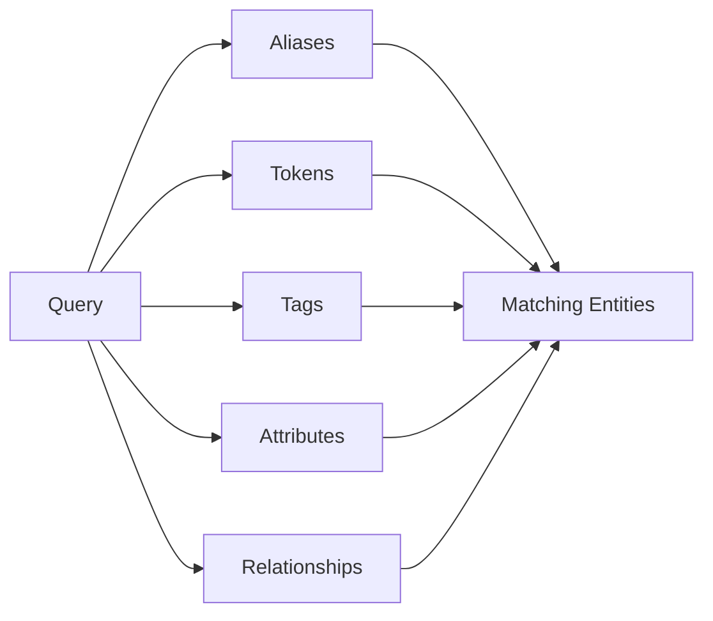
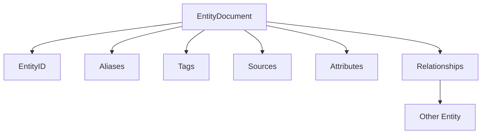

# EIR Data Model

EIR represents information as entities. An entity has an identifier and can
contain names, classification information, provenance, properties, and
relationships to other entities.

## Entity

An `EntityDocument` is the basic unit stored in an EIR database.

```text
EntityDocument
├── EntityID
├── aliases
├── tags
├── sources
├── attributes
└── relationships
```

For example:
```json
{
  "id": 1001,
  "aliases": [
    "FizzBerry Spark",
    "FizzBerry"
  ],
  "tags": [
    "drink",
    "berry"
  ],
  "sources": [
    {
      "provider": "Open Food Facts",
      "verified": true
    }
  ],
  "attributes": [],
  "relationships": []
}
```

## Entity ID

EntityID identifies an entity inside the database.

It is a small wrapper around an integer and is separate from the other
registry IDs used by EIR.

```text
EntityID
    │
    └── EntityDocument
```

## Aliases

Aliases are names by which an entity can be found.

An entity can have multiple aliases:
```text
Entity 1001
├── FizzBerry Spark
├── FizzBerry
└── Berry Spark
```
Aliases are used by exact, prefix, fuzzy, and token-based searches.

## Tags

Tags provide labels or categories for an entity.

```text
Entity 1001
├── drink
└── berry
```
Tags can be searched independently of an entity's aliases.

## Sources

Sources describe where information about an entity came from.

An entity can have information from multiple sources:
```text
Entity 1001
├── Open Food Facts
└── Manufacturer Registry
```
Sources can also be used when searching or filtering entities.

## Attributes

Attributes describe properties of an entity.

An attribute consists of a key and its value.
```text
Entity 1001
├── brand    = FizzBerry
├── category = Soft Drink
└── country  = Denmark
```
Attributes are different from aliases: an alias is another name for an
entity, while an attribute describes something about it.

## Relationships

Relationships connect one entity to another.
```text
FizzBerry Spark
      │
      └── manufactured_by ──> FizzBerry Foods
```
A relationship has a type and connects a source entity with another entity.

This allows information about related entities to participate in resolution.

## Registries

Some values occur repeatedly throughout a database. EIR uses registries to
assign internal IDs to these values.

The database currently has registries for:
```text
Tag
Source
Attribute Key
Relationship Type
```

For example, instead of storing the string "drink" everywhere, the tag
registry can assign it a TagID.
```text
Tag Registry

TagID 0 → drink
TagID 1 → berry
TagID 2 → food
```
The registry IDs are used internally by the database and its indexes.

## Search

The entity model provides several different ways for a query to find an
entity.


Alias searches include exact, prefix, and fuzzy matching.

The search system can combine multiple matches when producing its results.

## Model Overview


This document describes the concepts represented by EIR. Details about
database invariants, index maintenance, persistence, and implementation
behaviour are documented alongside the relevant Rust types and functions.
