# EIR Data Model

This document describes the data model used by Entity Identifier Resolver (EIR).

The model is centered around an **Entity Document**. An entity has one stable identifier and can be described using aliases, tags, sources, attributes, and relationships.

The database then builds registries and search indexes from these entities.

---

## Model Overview

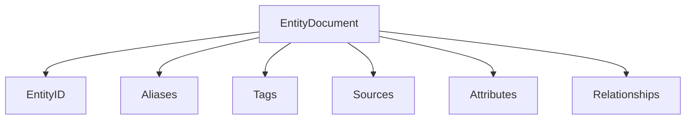

At its simplest:

```text
EntityDocument
│
├── EntityID
├── aliases
├── tags
├── sources
├── attributes
└── relationships
```

---

# Entity

An entity represents the thing EIR is trying to identify.

Example:

```json
{
  "id": 1001,
  "aliases": [
    "FizzBerry Spark",
    "FizzBerry",
    "Berry Spark"
  ],
  "tags": [
    "drink",
    "berry"
  ],
  "sources": [
    {
      "provider": "Open Food Facts",
      "verified": true
    }
  ],
  "attributes": [],
  "relationships": []
}
```

The important property is that **the entity ID is stable while the descriptive data can evolve**.

---

# Entity ID

Every entity has an `EntityID`.

```text
EntityID
   │
   └── uniquely identifies an entity
```

For example:

```text
1001 → FizzBerry Spark
1002 → FizzBerry Energy
1003 → Aurora Foods
```

The ID is used throughout the database, indexes, relationships, and search results.

---

# Aliases

Aliases are names by which an entity may be known.

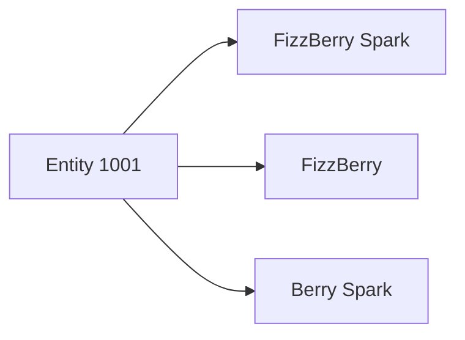

An entity can therefore have multiple searchable identifiers:

```text
1001
├── FizzBerry Spark
├── FizzBerry
└── Berry Spark
```

Aliases are used by several search mechanisms:

```text
Aliases
   │
   ├── Exact matching
   ├── Prefix matching
   ├── Fuzzy matching
   └── Token matching
```

---

# Tags

Tags describe categories or classifications associated with an entity.

```text
Entity 1001

Tags
├── drink
└── berry
```

Tags are indexed independently from aliases.

This allows queries such as:

```text
berry
tag:drink
```

to participate in search without requiring the tag to be an alias.

---

# Sources

Sources describe where information about an entity came from.

Example:

```json
{
  "provider": "Open Food Facts",
  "verified": true
}
```

An entity may have multiple sources:

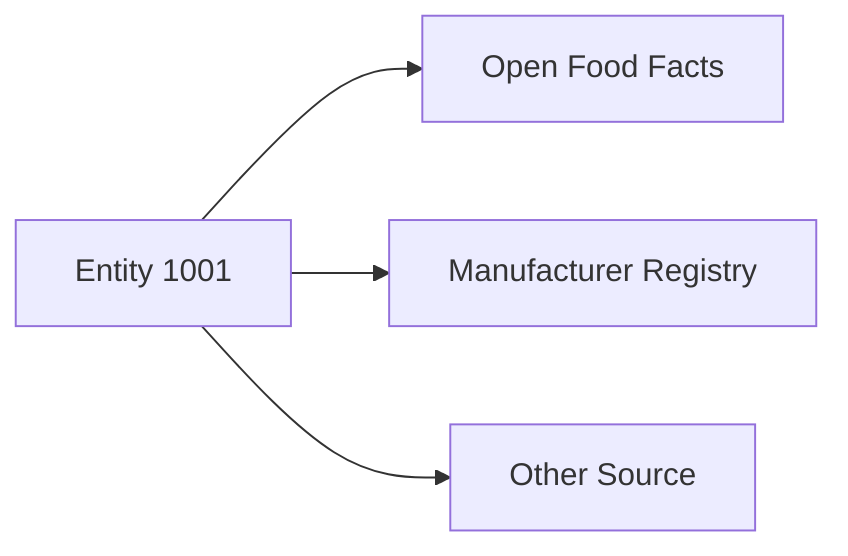

Sources are registered and indexed so that entities can be filtered or searched by provenance.

---

# Attributes

Attributes provide structured properties of an entity.

Conceptually:

```text
Entity
│
└── Attributes
    ├── key
    └── value
```

For example:

```text
Entity 1001

Attributes
├── brand = "FizzBerry"
├── category = "Soft Drink"
└── country = "Denmark"
```

Attributes are different from aliases.

An alias is intended to identify an entity.

An attribute describes something about the entity.

---

# Relationships

Relationships connect one entity to another.

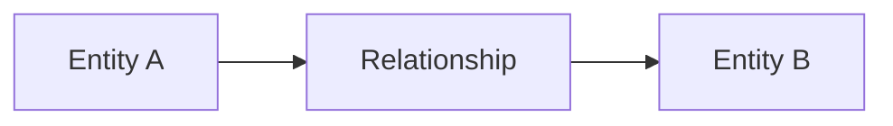

For example:

```text
FizzBerry Spark
      │
      │ manufactured_by
      ▼
FizzBerry Foods
```

Relationships consist conceptually of:

```text
source entity
relationship type
target entity
```

This allows EIR to represent connections between entities rather than treating every entity as an isolated document.

---

# Complete Entity Model

Putting the pieces together:

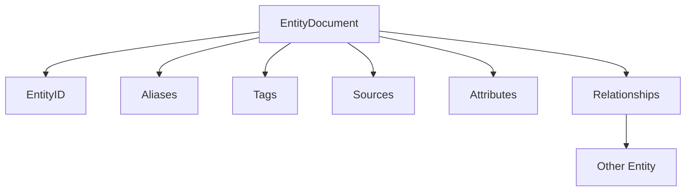

A more concrete example:

```text
┌─────────────────────────────────────────┐
│ Entity 1001                             │
│                                         │
│ FizzBerry Spark                         │
│                                         │
│ Aliases                                 │
│   • FizzBerry Spark                     │
│   • FizzBerry                           │
│   • Berry Spark                         │
│                                         │
│ Tags                                    │
│   • drink                               │
│   • berry                               │
│                                         │
│ Sources                                 │
│   • Open Food Facts                     │
│                                         │
│ Attributes                              │
│   • brand = FizzBerry                   │
│                                         │
│ Relationships                           │
│   • manufactured_by → Entity 2001       │
└─────────────────────────────────────────┘
```

---

# Registries

EIR uses registries for values that occur repeatedly across entities.

The main registries include:

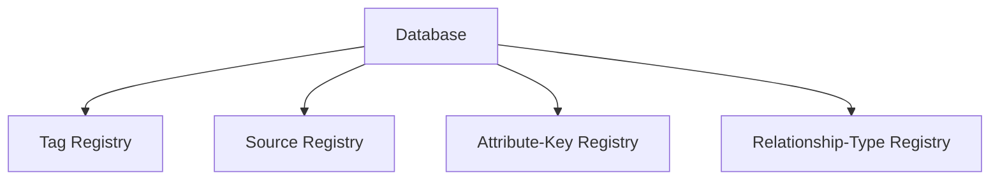

Instead of storing repeated strings everywhere, the database can assign internal identifiers.

For example:

```text
Tag Registry

0 → drink
1 → berry
2 → food
```

An entity can then refer to:

```text
Entity 1001
tags = [0, 1]
```

This reduces duplication and allows the indexes to operate on compact IDs.

---

# Database Model

Entities and registries are combined into the logical database.

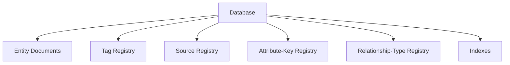

Conceptually:

```text
Database
│
├── Entities
│
├── Registries
│   ├── Tags
│   ├── Sources
│   ├── Attribute Keys
│   └── Relationship Types
│
└── Indexes
```

---

# From Model to Indexes

The database model is the source of truth.

Indexes are derived structures.

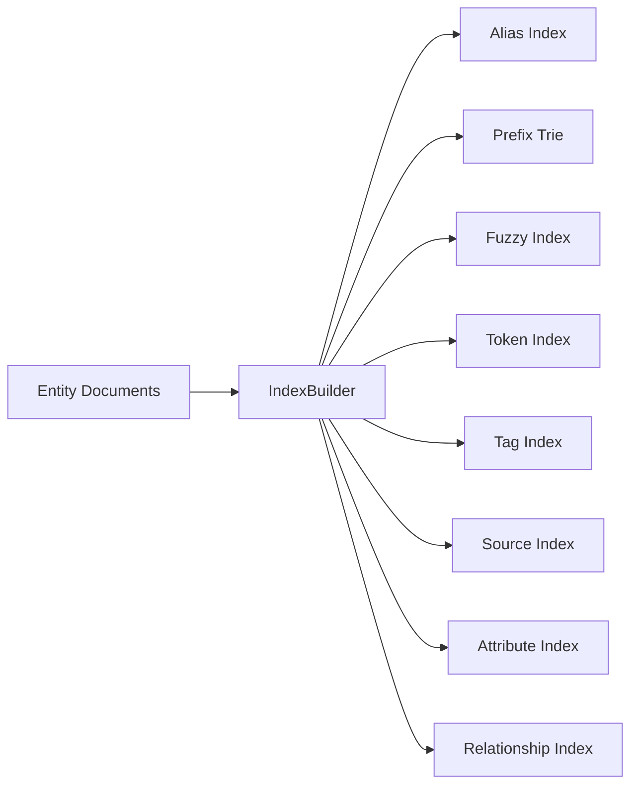

This distinction is important:

> **Entities are the data. Indexes are derived search structures.**

If an entity changes, the indexes must represent the new database state.

---

# Search Model

Search operates against the derived indexes.

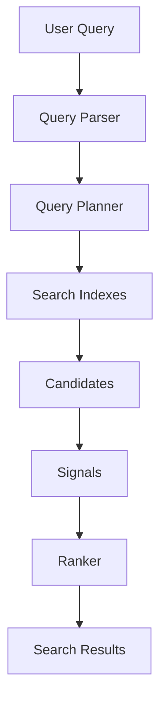

A result can therefore be understood as:

```text
Query
  │
  ▼
Candidate Entity
  │
  ├── matched alias
  ├── matched token
  ├── matched tag
  ├── matched property
  └── matched relationship
       │
       ▼
     Score
       │
       ▼
    Result
```

---

# Full Data Flow

The complete relationship between the model, database, indexes, and search engine is:

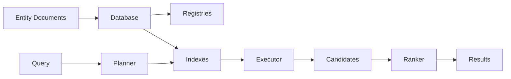

---

# Storage Model

The logical model is persisted separately from the search process.

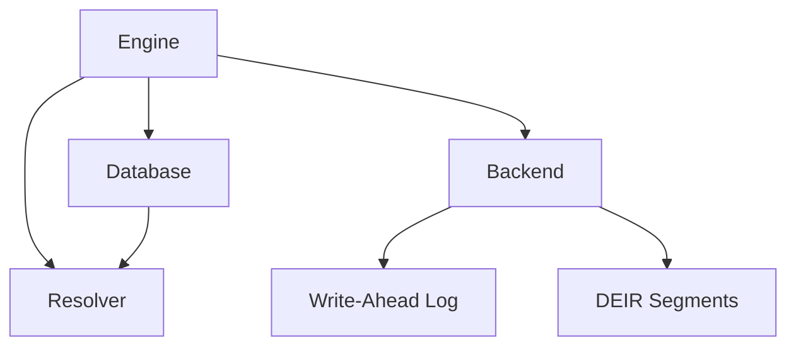

The engine therefore provides the bridge between:

```text
Logical Model
     │
     ▼
Database
     │
     ▼
Persistent Storage
```

while the resolver provides:

```text
Database
   │
   ▼
Indexes
   │
   ▼
Search
```

---

# Mutation Model

An entity mutation follows the database lifecycle.

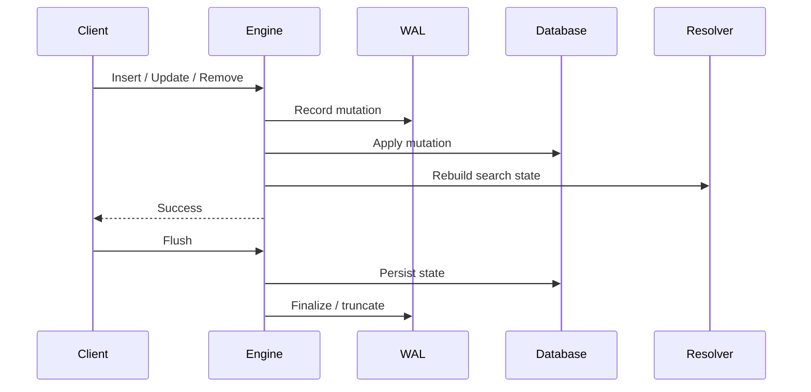

The important invariant is:

```text
Database state
      │
      ▼
Search indexes
      │
      ▼
Resolver state
```

The resolver should represent the current database.

---

# Model Invariants

The model is built around several important invariants.

### Entity IDs are unique

```text
EntityID → one entity
```

An insert using an existing ID is rejected.

### Entity IDs are stable

Changing an entity's aliases, tags, attributes, or relationships does not change its identity.

### Indexes are derived

Indexes should represent the current entity collection rather than becoming an independent source of truth.

### Registries are shared

Repeated tag, source, attribute-key, and relationship-type values are represented through registries.

### Relationships reference entities

A relationship connects entities rather than embedding a second copy of the target entity.

---

# Mental Model

The simplest way to think about EIR is:

```text
                    ENTITY
                      │
        ┌─────────────┼─────────────┐
        │             │             │
      Names        Metadata      Relations
        │             │             │
     Aliases    Tags / Sources   Entity → Entity
        │        Attributes         │
        │             │             │
        └─────────────┼─────────────┘
                      │
                      ▼
                    INDEX
                      │
                      ▼
                    SEARCH
                      │
                      ▼
                   RESULTS
```

Or, even more simply:

> **Entities are the source of truth. Registries make repeated values compact. Indexes make the entities searchable. The resolver turns queries into ranked entity matches.**
